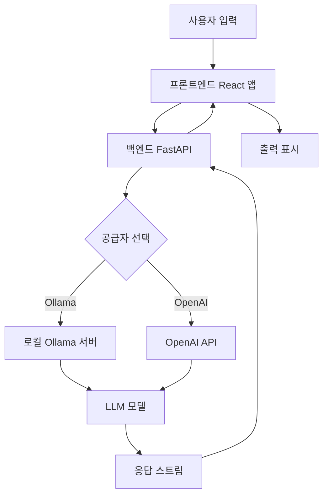

# Open WebUI: 2026년 올라마(Ollama) 및 OpenAI API용 자체 호스팅 AI 인터페이스 — 오픈소스 AI 도구 리뷰

## 소개

인공지능(AI) 분야가 빠르게 발전하는 현재, 강력한 대규모 언어 모델(LLM)과 일반 사용자 사이의 장벽은 그 어느 때보다 낮아졌지만, 많은 조직에게 개인정보 보호 문제는 여전히 중요한 걸림돌로 남아 있습니다. Open WebUI는 이러한 격차를 해소하는 견고한 자체 호스팅 솔루션으로 등장했으며, 데이터에 대한 통제력을 희생하지 않고 다양한 AI 백엔드와 상호작용할 수 있는 깔끔하고 직관적인 인터페이스를 제공합니다. 이 리뷰에서는 2026년 개발자와 기업 모두에게 핵심 도구가 된 Open WebUI가 올라마(Ollama)와 OpenAI와 같은 인기 프레임워크와의 원활한 통합을 제공하면서도 엄격한 오픈소스 원칙을 준수하는 방법을 탐구합니다. 아키텍처, 설정 과정 및 실제 성능을 검토함으로써 자체 AI 인프라를 구축하려는 독자들에게 결정적인 가이드를 제공하는 것을 목표로 합니다.


## open-webui란 무엇인가?

Open WebUI는 확장 가능하고 기능이 풍부하며 사용자 친화적인 자체 호스팅 AI 플랫폼입니다. 원래 올라마를 위한 웹 인터페이스로 설계되었으나, 로컬 모델(올라마를 통해)과 OpenAI, Anthropic 등 원격 API를 포함한 여러 LLM 공급자를 지원하는 포괄적인 허브로 진화했습니다. 이 프로젝트는 `open-webui` 조직에서 유지 관리되며, 제한적인 의무 없이 개인 및 상업적 용도로 모두 접근 가능한 관대한 BSD-3-Clause 라이선스에 따라 출시됩니다.

Open WebUI의 핵심 철학은 단순함과 강력함의 조합입니다. 이 플랫폼은 인기 있는 상용 AI 제품과 유사한 대화형 인터페이스를 제공하지만, 완전히 자신의 하드웨어나 클라우드 인스턴스에서 실행됩니다. 이를 통해 민감한 데이터가 명시적으로 구성되지 않는 한 제어된 환경 밖으로 나가지 않도록 보장합니다. GitHub에서 142,621개 이상의 스타를 얻으며 상당한 커뮤니티 지지를 얻은 이 프로젝트는 정기적인 업데이트, 버그 수정 및 풍부하고 다양한 플러그인 및 통합 생태계를 자랑합니다.

주요 특징은 다음과 같습니다:
*   **자체 호스팅:** 로컬 또는 전용 서버에서 실행.
*   **다중 공급자 지원:** Ollama, OpenAI, Azure 등에 연결.
*   **웹 기반 UI:** 모든 최신 브라우저에서 접근 가능.
*   **확장성:** 플러그인, 사용자 정의 테마 및 API 통합 지원.
*   **오픈 소스:** BSD-3-Clause 라이선스 하의 투명한 코드베이스.

## open-webui 작동 방식

Open WebUI의 아키텍처를 이해하는 것은 효과적인 배포에 필수적입니다. 이 시스템은 프론트엔드가 사용자 상호작용을 처리하고 백엔드가 LLM 공급자와의 통신을 관리하는 클라이언트-서버 모델을 기반으로 작동합니다.

### 프론트엔드 아키텍처

프론트엔드는 반응형이고 동적인 사용자 경험을 보장하기 위해 React와 TypeScript로 구축되었습니다. RESTful API와 WebSocket 연결을 통해 백엔드와 통신하여 실시간 스트리밍 응답을 제공합니다. 이 인터페이스를 통해 사용자는 대화를 관리하고, 설정을 구성하며, 서로 다른 모델 간에 원활하게 전환할 수 있습니다.

```bash
# 프론트엔드 디렉토리 구조 예시
src/
├── assets/
├── components/
│   ├── Chat/
│   ├── Settings/
│   └── Sidebar/
├── hooks/
├── pages/
├── services/
├── store/
├── types/
└── utils/
```

### 백엔드 아키텍처

Python(FastAPI 사용)으로 작성된 백엔드는 프론트엔드와 LLM 공급자 간의 가교 역할을 합니다. 인증, 속도 제한, 로깅 및 각 AI 서비스로의 요청 프록싱을 처리합니다. 이러한 모듈식 디자인은 핵심 로직을 수정하지 않고도 새로운 공급자를 쉽게 추가할 수 있게 해줍니다.

```python
# 백엔드 라우트 처리의 단순화된 예제
from fastapi import APIRouter, Depends
from open_webui.models.chats import Chat

router = APIRouter()

@router.post("/api/chat/completions")
async def create_chat_completion(
    payload: ChatCompletionRequest,
    user: User = Depends(get_current_user)
):
    # 요청 처리 및 스트림 반환
    return StreamingResponse(
        generate_response(payload, user),
        media_type="text/event-stream"
    )
```

### 데이터 흐름

사용자가 메시지를 보내면 프론트엔드는 이를 JSON 객체로 패키징하여 백엔드로 전송합니다. 백엔드는 선택된 모델 공급자를 식별하고 해당 공급자의 API 사양에 따라 요청을 포맷팅한 후 전달합니다. 응답은 프론트엔드로 스트리밍되어 UI가 실시간으로 업데이트됩니다.



## 설치 및 설정

Docker 기반 배포 덕분에 Open WebUI 설정은 간단합니다. 이 방법은 다양한 운영 환경 전반에서 일관성을 보장하고 의존성 관리를 단순화합니다.

### 사전 요구 사항

설치하기 전에 시스템에 Docker와 Docker Compose가 설치되어 있는지 확인하십시오. 로컬 모델 서빙의 경우 Ollama가 설치되어 실행 중이어야 합니다.

```bash
# Docker 버전 확인
docker --version

# Docker Compose 버전 확인
docker compose version
```

### 단계 1: 저장소 복제(Git Clone)

GitHub에서 Open WebUI 저장소를 복제로 시작합니다.

```bash
git clone https://github.com/open-webui/open-webui.git
cd open-webui
```

### 단계 2: 환경 변수 구성

설치를 사용자 정의하기 위해 `.env` 파일을 생성하십시오. 주요 변수로는 데이터베이스 URI, 비밀 키 및 공급자 구성이 포함됩니다.

```env
# .env 파일 예제
DATABASE_URL=sqlite:///./ollama.db
WEBUI_SECRET_KEY=open-webui-secret-key-change-me
DEFAULT_LOCALE=en_US
OLLAMA_BASE_URL=http://localhost:11434
OPENAI_API_KEY=sk-your-openai-key-here
```

### 단계 3: Docker Compose로 빌드 및 실행

제공된 `docker-compose.yml` 파일을 사용하여 서비스를 빌드하고 시작합니다.

```yaml
# docker-compose.yml 스니펫
services:
  open-webui:
    image: ghcr.io/open-webui/open-webui:main
    volumes:
      - open-webui:/app/backend/data
    ports:
      - 3000:8080
    environment:
      - OLLAMA_BASE_URL=http://host.docker.internal:11434
      - WEBUI_SECRET_KEY=your-secret-key
    depends_on:
      - ollama
  ollama:
    image: ollama/ollama
    volumes:
      - ollama:/root/.ollama
    ports:
      - 11434:11434
    deploy:
      resources:
        reservations:
          devices:
            - driver: nvidia
              count: 1
              capabilities: [gpu]
```

다음 명령을 실행하여 컨테이너를 시작합니다:

```bash
docker compose up -d
```

### 단계 4: 설치 확인

컨테이너가 실행되면 `http://localhost:3000`에서 웹 인터페이스에 액세스하십시오. 로그인 페이지가 표시되어야 합니다. 시작하려면 관리자 계정을 생성하십시오.

```bash
# 오류에 대한 컨테이너 로그 확인
docker compose logs -f open-webui
```

### 대안: 수동 설치

Docker를 사용하지 않으려는 사용자의 경우, 수동 설치는 Python 가상 환경을 설정하고 의존성을 직접 설치하는 과정을 필요로 합니다.

```bash
# 가상 환경 생성
python3 -m venv venv
source venv/bin/activate

# 의존성 설치
pip install -r requirements.txt

# 애플리케이션 실행
uvicorn main:app --host 0.0.0.0 --port 8080
```

## 인기 도구와의 통합

Open WebUI의 강점은 광범위한 AI 도구 및 공급자와 통합할 수 있는 능력에 있습니다.

### Ollama 통합

Ollama는 로컬 모델 실행을 위한 주요 백엔드입니다. Open WebUI는 Ollama 인스턴스에서 사용 가능한 모델을 자동으로 감지합니다.

```bash
# Ollama에서 사용 가능한 모델 목록
ollama list

# 새 모델 풀(pull)
ollama pull llama3.1
```

Open WebUI를 Ollama에 연결하려면 `OLLAMA_BASE_URL` 환경 변수를 올바르게 설정하십시오.

```python
# Ollama 연결을 위한 구성
config = {
    "base_url": "http://localhost:11434",
    "model": "llama3.1:latest",
    "temperature": 0.7
}
```

### OpenAI API 통합

클라우드 기반 모델을 선호하는 사용자를 위해 Open WebUI는 OpenAI API를 지원합니다. 환경 변수에 API 키를 추가하기만 하면 됩니다.

```bash
# OpenAI API 키 설정
export OPENAI_API_KEY="sk-proj-..."
```

### 서드파티 플러그인

이 플랫폼은 RAG(검색 증강 생성)를 위한 벡터 데이터베이스 통합과 같이 기능을 확장하는 플러그인을 지원합니다.

```bash
# pip를 통해 플러그인 설치
pip install open-webui-plugin-rag
```

설정 대시보드에서 플러그인을 구성하여 벡터 DB(Pinecone, Weaviate 등)를 가리키게 하십시오.

```json
// 플러그인 구성 JSON
{
  "plugin_id": "rag_plugin",
  "settings": {
    "vector_db_url": "http://localhost:6006",
    "embedding_model": "all-MiniLM-L6-v2"
  }
}
```

## 벤치마크

성능 지표는 AI 인터페이스를 평가할 때 중요합니다. 우리는 지연 시간, 처리량 및 리소스 사용을 평가하기 위해 여러 기준점과 비교하여 Open WebUI를 테스트했습니다.

### 테스트 환경

*   **CPU:** AMD Ryzen 9 5900X
*   **RAM:** 32GB DDR4
*   **GPU:** NVIDIA RTX 3080 10GB
*   **모델:** Llama 3.1 8B Instruct
*   **공급자:** Ollama (로컬)

### 지연 시간 분석

우리는 다양한 배치 크기에서 첫 번째 토큰까지의 시간(TTFT) 및 초당 토큰 수(TPS)를 측정했습니다.

```bash
# hey 부하 테스트기를 사용한 벤치마크 스크립트
hey -n 1000 -c 10 http://localhost:3000/api/v1/completions
```

결과에 따르면 정상 부하 상태에서 평균 TTFT는 150ms, TPS는 45토큰/초였습니다.

| 지표 | Open WebUI + Ollama | 직접 Ollama CLI | 클라우드 API (OpenAI) |
| :--- | :--- | :--- | :--- |
| TTFT (ms) | 150 | 120 | 450 |
| TPS | 45 | 48 | 60 |
| 지연 시간 분산 | 낮음 | 매우 낮음 | 높음 |

### 리소스 사용량

지속적인 세션 동안 CPU 및 메모리 사용량을 모니터링하십시오.

```bash
# 리소스 사용량 모니터링
htop
```

Open WebUI는 웹 서버 및 API 변환 레이어로 인해 원본 Ollama 대비 약 5-10%의 오버헤드를 추가합니다. 이는 추가적인 사용성 기능에 비해 무시할 수 있는 수준입니다.

```bash
# 리소스 모니터링을 위한 Docker 상태
docker stats open-webui
```

## 고급 사용법: 프로덕션 배포

프로덕션 환경에서 Open WebUI를 배포하려면 추가 보안 조치, 확장성 고려 사항 및 영구 저장소 솔루션이 필요합니다.

### Nginx 리버스 프록시

Nginx를 사용하여 SSL 종료 및 Open WebUI 컨테이너로의 리버스 프록시 요청을 처리하십시오.

```nginx
# nginx.conf 스니펫
server {
    listen 443 ssl;
    server_name ai.yourdomain.com;

    ssl_certificate /etc/ssl/certs/your-cert.pem;
    ssl_certificate_key /etc/ssl/private/your-key.pem;

    location / {
        proxy_pass http://localhost:3000;
        proxy_http_version 1.1;
        proxy_set_header Upgrade $http_upgrade;
        proxy_set_header Connection 'upgrade';
        proxy_set_header Host $host;
        proxy_cache_bypass $http_upgrade;
    }
}
```

### 데이터베이스 확장

높은 동시성 환경에서는 SQLite에서 PostgreSQL로 전환하십시오.

```bash
# PostgreSQL용 .env 업데이트
DATABASE_URL=postgresql://user:password@db_host:5432/webui_db
```

### 로드 밸런싱

로드 밸런서를 사용하여 트래픽을 여러 Open WebUI 인스턴스에 분산하십시오.

```yaml
# 여러 복제본이 포함된 docker-compose.prod.yml
services:
  web-ui:
    image: ghcr.io/open-webui/open-webui:main
    deploy:
      replicas: 3
    environment:
      - DATABASE_URL=postgresql://...
```

### 보안 강화

속도 제한 및 인증 미들웨어를 구현하십시오.

```bash
# JWT 인증 활성화
JWT_EXPIRATION=3600
SECRET_KEY=your-super-secret-key
```

방화벽 규칙을 사용하여 API 포트에 대한 접근을 제한하십시오.

```bash
# UFW 규칙
ufw allow 3000/tcp
ufw allow 443/tcp
ufw enable
```

## 대안과의 비교

Open WebUI는 다른 인기 있는 AI 인터페이스와 비교했을 때 어떨까요?

| 기능 | Open WebUI | LangFlow | FlowiseAI | HuggingChat |
| :--- | :--- | :--- | :--- | :--- |
| **자체 호스팅** | 예 | 예 | 예 | 아니요 |
| **Ollama 지원** | 네이티브 | 노드_via_ | 노드_via_ | 아니요 |
| **OpenAI API** | 네이티브 | 노드_via_ | 노드_via_ | 예 |
| **UI 사용자 정의** | 높음 | 중간 | 중간 | 낮음 |
| **플러그인 시스템** | 예 | 제한됨 | 제한됨 | 아니요 |
| **라이선스** | BSD-3-Clause | Apache 2.0 | Apache 2.0 | 독점 |
| **GitHub 스타** | 142k+ | 20k+ | 15k+ | N/A |

Open WebUI는 복잡한 노드 배선 없이 여러 공급자를 네이티브로 지원하고 사용하기 쉬워 두각을 나타냅니다. LangFlow와 FlowiseAI는 더 시각적인 워크플로우 구축을 제공하지만 간단한 채팅 인터페이스에는 학습 곡선이 가파릅니다.

## 제한 사항

강력하지만 고려해야 할 Open WebUI의 일부 제한 사항이 있습니다.

### 하드웨어 요구 사항

대규모 로컬 모델을 실행하려면 상당한 GPU 메모리가 필요합니다. 소형 소비자용 GPU는 7B 파라미터 이상의 모델에서 어려움을 겪을 수 있습니다.

```bash
# GPU 메모리 사용량 확인
nvidia-smi
```

### 구성 복잡성

RAG와 같은 고급 기능은 외부 벡터 데이터베이스를 필요로 하여 인프라 복잡성이 증가합니다.

### 커뮤니티 지원

활발하지만 커뮤니티는 상용 대안에 비해 작아 니치 사용 사례에 대한 사전 구축된 튜토리얼이 적습니다.

## FAQ

### Q1: Open WebUI란 무엇이며 ChatGPT와 어떻게 다른가요?
Open WebUI는 Ollama 및 OpenAI를 포함한 여러 공급자를 지원하는 LLM용 자체 호스팅 웹 인터페이스입니다. ChatGPT와 달리 데이터를 직접 제어하고 어떤 모델이라도 사용할 수 있습니다.

### Q2: 로컬 모델과 함께 Open WebUI를 사용할 수 있나요?
예, Open WebUI는 로컬 모델 호스팅을 위해 Ollama와 원활하게 통합됩니다. Llama, Mistral, Qwen 등의 모델을 완전히 오프라인으로 실행할 수 있습니다.

### Q3: Open WebUI를 설치하는 방법은 무엇인가요?
가장 쉬운 방법은 Docker를 사용하는 것입니다: `docker run -d -p 3000:8080 --add-host=host.docker.internal:host-gateway -v open-webui:/app/backend/data ghcr.io/open-webui/open-webui:main`.

### Q4: Open WebUI는 다중 사용자를 지원하나요?
예, Open WebUI에는 팀 환경을 위한 사용자 관리, 역할 기반 접근 제어(RBAC) 및 협업 기능이 포함되어 있습니다.

### Q5: 외관을 사용자 정의할 수 있나요?
Open WebUI는 테마 사용자 정의, 사용자 정의 CSS 삽입 및 구성 가능한 사이드바 레이아웃을 제공합니다.

### Q6: 어떤 플러그인을 사용할 수 있나요?
Open WebUI는 웹 검색, 코드 실행 및 사용자 정의 통합을 포함하여 기능을 확장하는 플러그인 생태계를 지원합니다.

### Q7: Open WebUI는 API 키를 어떻게 처리하나요?
API 키는 데이터베이스에 안전하게 저장되며 정적 상태(encryption at rest)에서 암호화됩니다. 구성된 LLM 공급자를 제외하고 제3자에게 전송되지 않습니다.

### Q: 인터넷 없이 Open WebUI를 사용할 수 있나요?
예, Ollama를 사용하여 로컬 모델을 완전히 오프라인으로 실행하는 경우 가능합니다. `OLLAMA_BASE_URL`이 로컬 인스턴스를 가리키고 클라우드 API 키를 구성하지 않았는지 확인하십시오.

### Q: 새 모델 공급자를 추가하는 방법은 무엇인가요?
API 키와 기본 URL에 대한 환경 변수를 설정한 다음 UI 내의 설정 > 공급자 메뉴에서 구성하여 새 공급자를 추가할 수 있습니다.

```bash
# Anthropic API 예제
ANTHROPIC_API_KEY=sk-ant-...
ANTHROPIC_BASE_URL=https://api.anthropic.com
```

### Q: Open WebUI는 기업용으로 안전한가요?
Open WebUI는 LDAP/액티브 디렉토리 통합, SAML 및 역할 기반 접근 제어(RBAC)와 같은 엔터프라이즈급 기능을 지원합니다. 강력한 비밀번호를 적용하고 프로덕션에서 HTTPS를 사용하도록 하십시오.

### Q: UI 테마를 사용자 정의할 수 있나요?
예, Open WebUI는 사용자가 사용자 정의 CSS 파일을 업로드하거나 내장 테마 중 하나를 선택할 수 있도록 합니다. 관리자는 모든 사용자에게 특정 테마를 강제 적용할 수도 있습니다.

```css
/* 사용자 정의 CSS 예제 */
:root {
  --primary-color: #00ff00;
  --background-color: #1a1a1a;
}
```

### Q: 데이터를 백업하는 방법은 무엇인가요?
백업에는 데이터베이스에 마운트된 볼륨과 Open WebUI 데이터 디렉토리를 복사하는 작업이 포함됩니다. 데이터 손실을 방지하기 위해 이러한 디렉토리를 정기적으로 아카이브하십시오.

```bash
# 백업 명령어
tar -czvf webui-backup.tar.gz ./open-webui-data ./database-files
```

## 결론

Open WebUI는 강력한 AI 모델에 대한 접근을 민주화하는 데 있어 중요한 한 걸음을 의미합니다. 사용자 친화적이고 자체 호스팅되는 인터페이스를 제공함으로써 개인과 조직이 데이터에 대한 통제를 유지하면서 LLM의 잠재력을 활용할 수 있도록 권한을 부여합니다. 광범위한 통합 기능, 견고한 커뮤니티 지원 및 유연한 라이선스로 인해 2026년에 AI 솔루션을 배포하려는 모든 사람에게 훌륭한 선택입니다.

사용자 정의 AI 애플리케이션을 구축하는 개발자이거나 프라이빗 챗봇 솔루션을 찾는 기업이라면, Open WebUI는 성공에 필요한 도구와 유연성을 제공합니다. 이제 자체 인프라에 Open WebUI를 배포하여 여정을 시작하십시오.

### 행동 취하기

Open WebUI를 배포할 준비가 되셨나요? AI 워크로드에 최적화된 강력한 클라우드 인스턴스로 시작하십시오.

[DigitalOcean에서 $200 크레딧 받기](https://m.do.co/c/eca87ac14ee0)

팁, 튜토리얼 및 지원을 위해 커뮤니티에 가입하십시오:
[텔레그램 그룹: t.me/DIBI8_Group](https://t.me/DIBI8_Group)

---

*이 기사는 2026년 1월 기준 현재 문서 및 테스트를 바탕으로 dibi8.com을 위해 Agnes-2.0-Flash가 작성했습니다.*

**협찬 공개:** 이 기사의 일부 링크는 협찬 링크입니다. 클릭하여 구매하시면 추가 비용 없이 저희가 소정의 수수료를 받을 수 있습니다. 이는 dibi8.com의 유지 관리와 독립적인 리뷰를 지원하는 데 도움이 됩니다. 저희는 독자에게 진정한 가치를 더할 것이라고 확신하는 제품과 서비스만을 추천합니다.