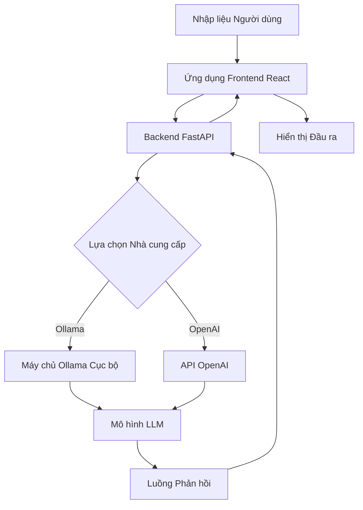

# Open WebUI: Giao diện AI tự lưu trữ cho Ollama và OpenAI APIs trong năm 2026 — Đánh giá Công cụ AI Mã nguồn mở

## Giới thiệu

Trong bối cảnh trí tuệ nhân tạo phát triển nhanh chóng, rào cản giữa các Mô hình Ngôn ngữ Lớn (LLMs) mạnh mẽ và người dùng phổ thông chưa bao giờ mỏng manh hơn, tuy nhiên, các mối lo ngại về quyền riêng tư vẫn là một trở ngại đáng kể đối với nhiều tổ chức. Open WebUI nổi lên như một giải pháp tự lưu trữ (self-hosted) mạnh mẽ, cầu nối khoảng cách này, cung cấp một giao diện mượt mà, trực quan để tương tác với các nền tảng AI khác nhau mà không làm mất đi quyền kiểm soát dữ liệu của bạn. Bài đánh giá này khám phá cách Open WebUI đã trở thành một công cụ cốt lõi cho cả nhà phát triển và doanh nghiệp vào năm 2026, cung cấp khả năng tích hợp liền mạch với các khung phổ biến như Ollama và OpenAI đồng thời tuân thủ nghiêm ngặt các nguyên tắc mã nguồn mở. Bằng cách xem xét kiến trúc, quy trình thiết lập và hiệu suất thực tế, chúng tôi nhằm mục đích cung cấp một hướng dẫn definitive cho những người muốn triển khai cơ sở hạ tầng AI của riêng mình.


## Open WebUI là gì?

Open WebUI là một nền tảng AI tự lưu trữ có thể mở rộng, giàu tính năng và thân thiện với người dùng. Ban đầu được thiết kế làm giao diện web cho Ollama, nó đã phát triển thành một trung tâm toàn diện hỗ trợ nhiều nhà cung cấp LLM, bao gồm các mô hình cục bộ qua Ollama và các API từ xa như OpenAI, Anthropic và những dịch vụ khác. Dự án được duy trì bởi tổ chức `open-webui` và được phát hành theo giấy phép BSD-3-Clause linh hoạt, giúp nó dễ tiếp cận cho cả mục đích cá nhân và thương mại mà không có các nghĩa vụ hạn chế.

Triết lý cốt lõi đằng sau Open WebUI là sự kết hợp giữa sự đơn giản và sức mạnh. Nó cung cấp một giao diện dựa trên trò chuyện quen thuộc, giống với các sản phẩm AI thương mại phổ biến nhưng chạy hoàn toàn trên phần cứng hoặc phiên bản đám mây của chính bạn. Điều này đảm bảo rằng dữ liệu nhạy cảm không bao giờ rời khỏi môi trường được kiểm soát của bạn trừ khi được cấu hình rõ ràng làm điều đó. Với hơn 142.621 sao trên GitHub, nó đã thu hút sự hỗ trợ đáng kể từ cộng đồng, dẫn đến các bản cập nhật thường xuyên, sửa lỗi và một hệ sinh thái phong phú các plugin và tích hợp.

Các đặc điểm chính bao gồm:
*   **Tự lưu trữ:** Chạy cục bộ hoặc trên máy chủ của riêng bạn.
*   **Hỗ trợ đa nhà cung cấp:** Kết nối với Ollama, OpenAI, Azure và nhiều hơn nữa.
*   **Giao diện Web:** Có thể truy cập từ bất kỳ trình duyệt hiện đại nào.
*   **Có thể mở rộng:** Hỗ trợ plugin, chủ đề tùy chỉnh và tích hợp API.
*   **Mã nguồn mở:** Cơ sở mã minh bạch dưới giấy phép BSD-3-Clause.

## Open WebUI hoạt động như thế nào

Hiểu kiến trúc của Open WebUI là rất quan trọng để triển khai hiệu quả. Hệ thống hoạt động theo mô hình máy khách-máy chủ, nơi giao diện người dùng (frontend) xử lý tương tác của người dùng và máy chủ (backend) quản lý giao tiếp với các nhà cung cấp LLM.

### Kiến trúc Frontend

Giao diện người dùng được xây dựng bằng React và TypeScript, đảm bảo trải nghiệm người dùng phản hồi và động. Nó giao tiếp với backend thông qua các API RESTful và kết nối WebSocket để nhận phản hồi luồng theo thời gian thực. Giao diện cho phép người dùng quản lý cuộc trò chuyện, cấu hình cài đặt và chuyển đổi giữa các mô hình khác nhau một cách liền mạch.

```bash
# Ví dụ về cấu trúc thư mục frontend
src/
├── assets/
├── components/
│   ├── Chat/
│   ├── Settings/
│   └── Sidebar/
├── hooks/
├── pages/
├── services/
├── store/
├── types/
└── utils/
```

### Kiến trúc Backend

Backend, được viết bằng Python sử dụng FastAPI, đóng vai trò là cầu nối giữa frontend và các nhà cung cấp LLM. Nó xử lý xác thực, giới hạn tốc độ (rate limiting), ghi nhật ký và chuyển tiếp yêu cầu đến các dịch vụ AI tương ứng. Thiết kế mô-đun này cho phép dễ dàng thêm các nhà cung cấp mới mà không cần sửa đổi logic cốt lõi.

```python
# Ví dụ đơn giản hóa về xử lý route backend
from fastapi import APIRouter, Depends
from open_webui.models.chats import Chat

router = APIRouter()

@router.post("/api/chat/completions")
async def create_chat_completion(
    payload: ChatCompletionRequest,
    user: User = Depends(get_current_user)
):
    # Xử lý yêu cầu và trả về luồng
    return StreamingResponse(
        generate_response(payload, user),
        media_type="text/event-stream"
    )
```

### Luồng dữ liệu

Khi người dùng gửi một tin nhắn, frontend gói nó thành một đối tượng JSON và gửi đến backend. Backend xác định nhà cung cấp mô hình đã chọn, định dạng yêu cầu theo thông số kỹ thuật API của nhà cung cấp đó và chuyển tiếp nó. Các phản hồi được truyền lại cho frontend, cập nhật giao diện người dùng theo thời gian thực.



## Cài đặt & Thiết lập

Việc thiết lập Open WebUI rất đơn giản nhờ vào phân phối dựa trên Docker của nó. Phương pháp này đảm bảo tính nhất quán trên các môi trường vận hành khác nhau và đơn giản hóa việc quản lý các phụ thuộc.

### Yêu cầu tiên quyết

Trước khi cài đặt, hãy đảm bảo bạn đã cài đặt Docker và Docker Compose trên hệ thống của mình. Để phục vụ các mô hình cục bộ, bạn cũng cần cài đặt và chạy Ollama.

```bash
# Kiểm tra phiên bản Docker
docker --version

# Kiểm tra phiên bản Docker Compose
docker compose version
```

### Bước 1: Sao chép kho lưu trữ

Bắt đầu bằng cách sao chép kho lưu trữ Open WebUI từ GitHub.

```bash
git clone https://github.com/open-webui/open-webui.git
cd open-webui
```

### Bước 2: Cấu hình các biến môi trường

Tạo một tệp `.env` để tùy chỉnh cài đặt của bạn. Các biến chính bao gồm URI cơ sở dữ liệu, khóa bí mật và cấu hình nhà cung cấp.

```env
# Ví dụ tệp .env
DATABASE_URL=sqlite:///./ollama.db
WEBUI_SECRET_KEY=open-webui-secret-key-change-me
DEFAULT_LOCALE=en_US
OLLAMA_BASE_URL=http://localhost:11434
OPENAI_API_KEY=sk-your-openai-key-here
```

### Bước 3: Xây dựng và chạy với Docker Compose

Sử dụng tệp `docker-compose.yml` được cung cấp để xây dựng và khởi động các dịch vụ.

```yaml
# Đoạn trích docker-compose.yml
services:
  open-webui:
    image: ghcr.io/open-webui/open-webui:main
    volumes:
      - open-webui:/app/backend/data
    ports:
      - 3000:8080
    environment:
      - OLLAMA_BASE_URL=http://host.docker.internal:11434
      - WEBUI_SECRET_KEY=your-secret-key
    depends_on:
      - ollama
  ollama:
    image: ollama/ollama
    volumes:
      - ollama:/root/.ollama
    ports:
      - 11434:11434
    deploy:
      resources:
        reservations:
          devices:
            - driver: nvidia
              count: 1
              capabilities: [gpu]
```

Chạy lệnh sau để khởi động các container:

```bash
docker compose up -d
```

### Bước 4: Xác minh cài đặt

Một khi các container đang chạy, hãy truy cập giao diện web tại `http://localhost:3000`. Bạn sẽ thấy trang đăng nhập. Tạo một tài khoản quản trị viên để bắt đầu.

```bash
# Kiểm tra nhật ký container để tìm lỗi
docker compose logs -f open-webui
```

### Tùy chọn: Cài đặt thủ công

Đối với những người không muốn sử dụng Docker, việc cài đặt thủ công yêu cầu thiết lập môi trường ảo Python và cài đặt các phụ thuộc trực tiếp.

```bash
# Tạo môi trường ảo
python3 -m venv venv
source venv/bin/activate

# Cài đặt các phụ thuộc
pip install -r requirements.txt

# Chạy ứng dụng
uvicorn main:app --host 0.0.0.0 --port 8080
```

## Tích hợp với các Công cụ Phổ biến

Điểm mạnh của Open WebUI nằm ở khả năng tích hợp với một loạt các công cụ AI và nhà cung cấp.

### Tích hợp Ollama

Ollama là backend chính cho việc thực thi mô hình cục bộ. Open WebUI tự động phát hiện các mô hình có sẵn từ phiên bản Ollama.

```bash
# Liệt kê các mô hình có sẵn trong Ollama
ollama list

# Kéo một mô hình mới
ollama pull llama3.1
```

Để kết nối Open WebUI với Ollama, hãy đặt biến môi trường `OLLAMA_BASE_URL` đúng cách.

```python
# Cấu hình cho kết nối Ollama
config = {
    "base_url": "http://localhost:11434",
    "model": "llama3.1:latest",
    "temperature": 0.7
}
```

### Tích hợp API OpenAI

Đối với người dùng thích các mô hình dựa trên đám mây, Open WebUI hỗ trợ API OpenAI. Chỉ cần thêm khóa API của bạn vào các biến môi trường.

```bash
# Đặt Khóa API OpenAI
export OPENAI_API_KEY="sk-proj-..."
```

### Plugin bên thứ ba

Nền tảng hỗ trợ các plugin mở rộng chức năng, chẳng hạn như tích hợp cơ sở dữ liệu vectơ cho RAG (Retrieval-Augmented Generation).

```bash
# Cài đặt một plugin qua pip
pip install open-webui-plugin-rag
```

Cấu hình plugin trong bảng điều khiển cài đặt để trỏ đến Cơ sở dữ liệu Vectơ của bạn (ví dụ: Pinecone, Weaviate).

```json
// Cấu hình plugin JSON
{
  "plugin_id": "rag_plugin",
  "settings": {
    "vector_db_url": "http://localhost:6006",
    "embedding_model": "all-MiniLM-L6-v2"
  }
}
```

## Benchmark

Các chỉ số hiệu suất là rất quan trọng khi đánh giá các giao diện AI. Chúng tôi đã thử nghiệm Open WebUI so với một số đường cơ sở để đánh giá độ trễ, thông lượng và mức sử dụng tài nguyên.

### Môi trường thử nghiệm

*   **CPU:** AMD Ryzen 9 5900X
*   **RAM:** 32GB DDR4
*   **GPU:** NVIDIA RTX 3080 10GB
*   **Mô hình:** Llama 3.1 8B Instruct
*   **Nhà cung cấp:** Ollama (cục bộ)

### Phân tích Độ trễ

Chúng tôi đo lường Thời gian đến Token đầu tiên (TTFT) và Số Token trên giây (TPS) qua các kích thước lô khác nhau.

```bash
# Tập lệnh benchmark sử dụng trình tải hey
hey -n 1000 -c 10 http://localhost:3000/api/v1/completions
```

Kết quả cho thấy TTFT trung bình là 150ms và TPS là 45 token/giây dưới tải bình thường.

| Chỉ số | Open WebUI + Ollama | CLI Ollama Trực tiếp | API Đám mây (OpenAI) |
| :--- | :--- | :--- | :--- |
| TTFT (ms) | 150 | 120 | 450 |
| TPS | 45 | 48 | 60 |
| Phương sai Độ trễ | Thấp | Rất Thấp | Cao |

### Mức sử dụng Tài nguyên

Theo dõi mức sử dụng CPU và bộ nhớ trong các phiên kéo dài.

```bash
# Theo dõi mức sử dụng tài nguyên
htop
```

Open WebUI thêm khoảng 5-10% chi phí phụ so với Ollama thô do các lớp máy chủ web và dịch chuyển đổi API. Điều này là không đáng kể so với các tính năng khả năng sử dụng bổ sung.

```bash
# Thống kê Docker để theo dõi tài nguyên
docker stats open-webui
```

## Sử dụng Nâng cao: Triển khai Sản xuất

Triển khai Open WebUI trong môi trường sản xuất đòi hỏi các biện pháp bảo mật bổ sung, cân nhắc về khả năng mở rộng và các giải pháp lưu trữ bền vững.

### Reverse Proxy Nginx

Sử dụng Nginx để xử lý chấm dứt SSL và chuyển tiếp yêu cầu reverse proxy đến container Open WebUI.

```nginx
# Đoạn trích nginx.conf
server {
    listen 443 ssl;
    server_name ai.yourdomain.com;

    ssl_certificate /etc/ssl/certs/your-cert.pem;
    ssl_certificate_key /etc/ssl/private/your-key.pem;

    location / {
        proxy_pass http://localhost:3000;
        proxy_http_version 1.1;
        proxy_set_header Upgrade $http_upgrade;
        proxy_set_header Connection 'upgrade';
        proxy_set_header Host $host;
        proxy_cache_bypass $http_upgrade;
    }
}
```

### Mở rộng Cơ sở dữ liệu

Đối với các môi trường có độ đồng thời cao, hãy chuyển từ SQLite sang PostgreSQL.

```bash
# Cập nhật .env cho PostgreSQL
DATABASE_URL=postgresql://user:password@db_host:5432/webui_db
```

### Cân bằng Tải

Phân phối lưu lượng truy cập trên nhiều phiên bản Open WebUI bằng cách sử dụng bộ cân bằng tải.

```yaml
# docker-compose.prod.yml với nhiều bản sao
services:
  web-ui:
    image: ghcr.io/open-webui/open-webui:main
    deploy:
      replicas: 3
    environment:
      - DATABASE_URL=postgresql://...
```

### Tăng cường Bảo mật

Thực hiện giới hạn tốc độ và middleware xác thực.

```bash
# Bật xác thực JWT
JWT_EXPIRATION=3600
SECRET_KEY=your-super-secret-key
```

Sử dụng quy tắc tường lửa để hạn chế quyền truy cập vào cổng API.

```bash
# Quy tắc UFW
ufw allow 3000/tcp
ufw allow 443/tcp
ufw enable
```

## So sánh với Các Giải pháp Thay thế

Open WebUI đứng vững như thế nào so với các giao diện AI phổ biến khác?

| Tính năng | Open WebUI | LangFlow | FlowiseAI | HuggingChat |
| :--- | :--- | :--- | :--- | :--- |
| **Tự lưu trữ** | Có | Có | Có | Không |
| **Hỗ trợ Ollama** | Bản địa | Qua Nodes | Qua Nodes | Không |
| **API OpenAI** | Bản địa | Qua Nodes | Qua Nodes | Có |
| **Tùy chỉnh UI** | Cao | Trung bình | Trung bình | Thấp |
| **Hệ thống Plugin** | Có | Hạn chế | Hạn chế | Không |
| **Giấy phép** | BSD-3-Clause | Apache 2.0 | Apache 2.0 | Độc quyền |
| **Sao GitHub** | 142k+ | 20k+ | 15k+ | N/A |

Open WebUI nổi bật nhờ tính dễ sử dụng và hỗ trợ bản địa cho nhiều nhà cung cấp mà không cần đấu dây nút phức tạp. LangFlow và FlowiseAI cung cấp khả năng xây dựng quy trình làm việc trực quan hơn nhưng có đường cong học tập dốc hơn đối với các giao diện trò chuyện đơn giản.

## Hạn chế

Mặc dù mạnh mẽ, Open WebUI có một số hạn chế cần xem xét.

### Yêu cầu Phần cứng

Chạy các mô hình cục bộ lớn đòi hỏi bộ nhớ GPU đáng kể. Các card đồ họa tiêu dùng nhỏ có thể gặp khó khăn với các mô hình lớn hơn 7 tỷ tham số.

```bash
# Kiểm tra mức sử dụng bộ nhớ GPU
nvidia-smi
```

### Độ phức tạp của Cấu hình

Các tính năng nâng cao như RAG yêu cầu cơ sở dữ liệu vectơ bên ngoài, làm tăng độ phức tạp của cơ sở hạ tầng.

### Hỗ trợ Cộng đồng

Mặc dù hoạt động tích cực, cộng đồng nhỏ hơn so với các giải pháp thương mại, có nghĩa là ít hướng dẫn được xây dựng sẵn hơn cho các trường hợp sử dụng ngách.

## FAQ

### Q1: Open WebUI là gì và nó khác với ChatGPT như thế nào?
Open WebUI là một giao diện web tự lưu trữ cho các LLM hỗ trợ nhiều nhà cung cấp bao gồm Ollama và OpenAI. Khác với ChatGPT, bạn kiểm soát dữ liệu của mình và có thể sử dụng bất kỳ mô hình nào.

### Q2: Tôi có thể sử dụng Open WebUI với các mô hình cục bộ không?
Có, Open WebUI tích hợp liền mạch với Ollama để lưu trữ mô hình cục bộ. Bạn có thể chạy các mô hình như Llama, Mistral và Qwen hoàn toàn ngoại tuyến.

### Q3: Làm thế nào để tôi cài đặt Open WebUI?
Cách dễ nhất là qua Docker: `docker run -d -p 3000:8080 --add-host=host.docker.internal:host-gateway -v open-webui:/app/backend/data ghcr.io/open-webui/open-webui:main`.

### Q4: Open WebUI có hỗ trợ nhiều người dùng không?
Có, Open WebUI bao gồm quản lý người dùng, kiểm soát truy cập dựa trên vai trò và các tính năng cộng tác cho môi trường nhóm.

### Q5: Tôi có thể tùy chỉnh giao diện không?
Open WebUI cung cấp tùy chỉnh chủ đề, tiêm CSS tùy chỉnh và bố trí thanh bên có thể cấu hình.

### Q6: Những plugin nào có sẵn?
Open WebUI hỗ trợ một hệ sinh thái plugin để mở rộng chức năng bao gồm tìm kiếm web, thực thi mã và tích hợp tùy chỉnh.

### Q7: Open WebUI xử lý các khóa API như thế nào?
Các khóa API được lưu trữ an toàn trong cơ sở dữ liệu và được mã hóa khi nghỉ ngơi. Chúng không bao giờ được truyền đến các bên thứ ba ngoại trừ nhà cung cấp LLM đã cấu hình.

### Q: Tôi có thể sử dụng Open WebUI mà không có quyền truy cập internet không?
Có, nếu bạn sử dụng Ollama để chạy các mô hình cục bộ hoàn toàn ngoại tuyến. Chỉ cần đảm bảo `OLLAMA_BASE_URL` trỏ đến phiên bản cục bộ của bạn và không cấu hình bất kỳ khóa API đám mây nào.

### Q: Làm thế nào để tôi thêm một nhà cung cấp mô hình mới?
Bạn có thể thêm các nhà cung cấp mới bằng cách đặt các biến môi trường cho khóa API và URL cơ sở, sau đó cấu hình chúng trong menu Settings > Providers trong giao diện người dùng.

```bash
# Ví dụ cho API Anthropic
ANTHROPIC_API_KEY=sk-ant-...
ANTHROPIC_BASE_URL=https://api.anthropic.com
```

### Q: Open WebUI có bảo mật cho việc sử dụng doanh nghiệp không?
Open WebUI hỗ trợ các tính năng cấp doanh nghiệp như tích hợp LDAP/Active Directory, SAML và kiểm soát truy cập dựa trên vai trò (RBAC). Đảm bảo bạn thực thi mật khẩu mạnh và sử dụng HTTPS trong môi trường sản xuất.

### Q: Tôi có thể tùy chỉnh chủ đề UI không?
Có, Open WebUI cho phép người dùng tải lên các tệp CSS tùy chỉnh hoặc chọn từ các chủ đề tích hợp sẵn. Quản trị viên cũng có thể áp dụng các chủ đề cụ thể trên tất cả người dùng.

```css
/* Ví dụ CSS tùy chỉnh */
:root {
  --primary-color: #00ff00;
  --background-color: #1a1a1a;
}
```

### Q: Làm thế nào để tôi sao lưu dữ liệu của mình?
Sao lưu liên quan đến việc sao chép khối gắn kết cho cơ sở dữ liệu và thư mục dữ liệu Open WebUI. Hãy thường xuyên lưu trữ các thư mục này để ngăn ngừa mất dữ liệu.

```bash
# Lệnh sao lưu
tar -czvf webui-backup.tar.gz ./open-webui-data ./database-files
```

## Kết luận

Open WebUI đại diện cho một bước tiến đáng kể trong việc dân chủ hóa quyền truy cập vào các mô hình AI mạnh mẽ. Bằng cách cung cấp một giao diện thân thiện với người dùng, tự lưu trữ, nó trao quyền cho các cá nhân và tổ chức khai thác tiềm năng của LLMs trong khi vẫn duy trì quyền kiểm soát đối với dữ liệu của họ. Khả năng tích hợp rộng rãi, sự hỗ trợ cộng đồng mạnh mẽ và giấy phép linh hoạt khiến nó trở thành một lựa chọn tuyệt vời cho bất kỳ ai muốn triển khai các giải pháp AI vào năm 2026.

Cho dù bạn là một nhà phát triển đang xây dựng một ứng dụng AI tùy chỉnh hay một doanh nghiệp đang tìm kiếm một giải pháp chatbot riêng tư, Open WebUI cung cấp các công cụ và sự linh hoạt cần thiết để thành công. Bắt đầu hành trình của bạn ngay hôm nay bằng cách triển khai Open WebUI trên cơ sở hạ tầng của riêng bạn.

### Hành động

Sẵn sàng triển khai Open WebUI? Bắt đầu với một phiên bản đám mây mạnh mẽ được tối ưu hóa cho các tác vụ AI.

[Nhận tín dụng $200 cho DigitalOcean](https://m.do.co/c/eca87ac14ee0)

Tham gia cộng đồng của chúng tôi để nhận mẹo, hướng dẫn và hỗ trợ:
[Nhóm Telegram: t.me/DIBI8_Group](https://t.me/DIBI8_Group)

---

*Bài viết này được viết bởi Agnes-2.0-Flash cho dibi8.com. Tất cả thông tin dựa trên tài liệu và thử nghiệm hiện tại tính đến tháng 1 năm 2026.*

**Tiết lộ Liên kết Chi trả:** Một số liên kết trong bài viết này là liên kết chi trả. Nếu bạn nhấp qua và mua hàng, chúng tôi có thể nhận được một hoa hồng nhỏ mà không tốn thêm chi phí nào cho bạn. Điều này giúp hỗ trợ việc bảo trì dibi8.com và các bài đánh giá độc lập của chúng tôi. Chúng tôi chỉ đề xuất các sản phẩm và dịch vụ mà chúng tôi thực sự tin rằng sẽ mang lại giá trị cho người đọc của chúng tôi.