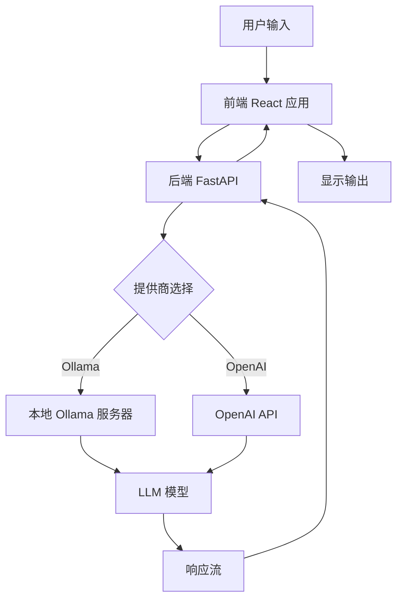

# Open WebUI：2026年面向 Ollama 和 OpenAI API 的自托管 AI 界面——开源 AI 工具评测

## 简介

在人工智能快速演进的格局中，强大的大语言模型（LLM）与日常用户之间的壁垒从未如此薄弱，然而隐私问题仍然是许多机构面临的主要障碍。Open WebUI 作为一个稳健的自托管解决方案应运而生，它弥合了这一差距，提供了一个时尚、直观的界面，用于与各种 AI 后端进行交互，同时不会牺牲对数据的控制权。本评测探讨了 Open WebUI 如何在 2026 年成为开发人员和企业的核心工具，它与 Ollama 和 OpenAI 等流行框架无缝集成，同时严格遵守开源原则。通过考察其架构、设置过程和实际性能，我们旨在为那些希望部署自己 AI 基础设施的人提供一份权威指南。


## 什么是 open-webui？

Open WebUI 是一个可扩展、功能丰富且用户友好的自托管 AI 平台。它最初是作为 Ollama 的 Web 界面设计的，现已发展成为一个综合中心，支持多个 LLM 提供商，包括通过 Ollama 运行的本地模型以及 OpenAI、Anthropic 等远程 API。该项目由 `open-webui` 组织维护，并在宽松的 BSD-3-Clause 许可证下发布，使其既可用于个人用途，也可用于商业用途，且没有限制性义务。

Open WebUI 背后的核心理念是简单性与强大功能的结合。它提供了一个类似流行的商业 AI 产品的基于聊天的界面，但完全运行在您自己的硬件或云实例上。这确保了敏感数据除非明确配置，否则永远不会离开您的受控环境。凭借 GitHub 上超过 142,621 颗星标，它获得了大量的社区支持，从而带来了定期的更新、错误修复以及丰富的插件和集成生态系统。

主要特点包括：
*   **自托管：** 在本地或您自己的服务器上运行。
*   **多提供商支持：** 连接 Ollama、OpenAI、Azure 等。
*   **基于 Web 的 UI：** 可从任何现代浏览器访问。
*   **可扩展：** 支持插件、自定义主题和 API 集成。
*   **开源：** BSD-3-Clause 许可证下的透明代码库。

## open-webui 的工作原理

了解 Open WebUI 的架构对于有效部署至关重要。该系统采用客户端-服务器模型，前端处理用户交互，后端管理与 LLM 提供商的通信。

### 前端架构

前端使用 React 和 TypeScript 构建，确保响应迅速且动态的用户体验。它通过 RESTful API 和 WebSocket 连接与后端通信，以实现实时流式响应。该界面允许用户管理对话、配置设置并无缝切换不同的模型。

```bash
# 前端目录结构示例
src/
├── assets/
├── components/
│   ├── Chat/
│   ├── Settings/
│   └── Sidebar/
├── hooks/
├── pages/
├── services/
├── store/
├── types/
└── utils/
```

### 后端架构

后端使用 Python 和 FastAPI 编写，充当前端与 LLM 提供商之间的桥梁。它处理身份验证、速率限制、日志记录以及将请求代理到相应的 AI 服务。这种模块化设计使得在不修改核心逻辑的情况下轻松添加新提供商成为可能。

```python
# 后端路由处理的简化示例
from fastapi import APIRouter, Depends
from open_webui.models.chats import Chat

router = APIRouter()

@router.post("/api/chat/completions")
async def create_chat_completion(
    payload: ChatCompletionRequest,
    user: User = Depends(get_current_user)
):
    # 处理请求并返回流
    return StreamingResponse(
        generate_response(payload, user),
        media_type="text/event-stream"
    )
```

### 数据流

当用户发送消息时，前端将其打包为 JSON 对象并发送到后端。后端识别所选的模型提供商，根据该提供商的 API 规范格式化请求并将其转发。响应流式传输回前端，前端实时更新 UI。



## 安装与设置

得益于其基于 Docker 的分发方式，设置 Open WebUI 非常简单。这种方法确保了不同操作系统环境之间的一致性，并简化了依赖项管理。

### 先决条件

在安装之前，请确保您的系统上已安装 Docker 和 Docker Compose。对于本地模型服务，您还需要安装并运行 Ollama。

```bash
# 检查 Docker 版本
docker --version

# 检查 Docker Compose 版本
docker compose version
```

### 步骤 1：克隆仓库

首先从 GitHub 克隆 Open WebUI 仓库。

```bash
git clone https://github.com/open-webui/open-webui.git
cd open-webui
```

### 步骤 2：配置环境变量

创建一个 `.env` 文件来自定义您的安装。关键变量包括数据库 URI、密钥和提供商配置。

```env
# .env 文件示例
DATABASE_URL=sqlite:///./ollama.db
WEBUI_SECRET_KEY=open-webui-secret-key-change-me
DEFAULT_LOCALE=en_US
OLLAMA_BASE_URL=http://localhost:11434
OPENAI_API_KEY=sk-your-openai-key-here
```

### 步骤 3：使用 Docker Compose 构建和运行

使用提供的 `docker-compose.yml` 文件来构建和启动服务。

```yaml
# docker-compose.yml 片段
services:
  open-webui:
    image: ghcr.io/open-webui/open-webui:main
    volumes:
      - open-webui:/app/backend/data
    ports:
      - 3000:8080
    environment:
      - OLLAMA_BASE_URL=http://host.docker.internal:11434
      - WEBUI_SECRET_KEY=your-secret-key
    depends_on:
      - ollama
  ollama:
    image: ollama/ollama
    volumes:
      - ollama:/root/.ollama
    ports:
      - 11434:11434
    deploy:
      resources:
        reservations:
          devices:
            - driver: nvidia
              count: 1
              capabilities: [gpu]
```

运行以下命令以启动容器：

```bash
docker compose up -d
```

### 步骤 4：验证安装

容器运行后，访问 `http://localhost:3000` 上的 Web 界面。您应该看到登录页面。创建一个管理员账户即可开始使用。

```bash
# 检查容器日志中的错误
docker compose logs -f open-webui
```

### 替代方案：手动安装

对于那些不喜欢使用 Docker 的人，手动安装需要设置 Python 虚拟环境并直接安装依赖项。

```bash
# 创建虚拟环境
python3 -m venv venv
source venv/bin/activate

# 安装依赖项
pip install -r requirements.txt

# 运行应用程序
uvicorn main:app --host 0.0.0.0 --port 8080
```

## 与流行工具的集成

Open WebUI 的优势在于其能够与广泛的 AI 工具和提供商集成。

### Ollama 集成

Ollama 是本地模型执行的主要后端。Open WebUI 会自动检测 Ollama 实例中可用的模型。

```bash
# 列出 Ollama 中的可用模型
ollama list

# 拉取新模型
ollama pull llama3.1
```

要将 Open WebUI 连接到 Ollama，请正确设置 `OLLAMA_BASE_URL` 环境变量。

```python
# Ollama 连接的配置
config = {
    "base_url": "http://localhost:11434",
    "model": "llama3.1:latest",
    "temperature": 0.7
}
```

### OpenAI API 集成

对于偏好基于云的模型的用户，Open WebUI 支持 OpenAI API。只需将您的 API 密钥添加到环境变量中即可。

```bash
# 设置 OpenAI API 密钥
export OPENAI_API_KEY="sk-proj-..."
```

### 第三方插件

该平台支持扩展功能的插件，例如用于 RAG（检索增强生成）的向量数据库集成。

```bash
# 通过 pip 安装插件
pip install open-webui-plugin-rag
```

在设置仪表板中配置插件以指向您的向量数据库（例如 Pinecone、Weaviate）。

```json
// 插件配置 JSON
{
  "plugin_id": "rag_plugin",
  "settings": {
    "vector_db_url": "http://localhost:6006",
    "embedding_model": "all-MiniLM-L6-v2"
  }
}
```

## 基准测试

在评估 AI 界面时，性能指标至关重要。我们将 Open WebUI 与几个基线进行了对比测试，以评估延迟、吞吐量和资源使用情况。

### 测试环境

*   **CPU:** AMD Ryzen 9 5900X
*   **RAM:** 32GB DDR4
*   **GPU:** NVIDIA RTX 3080 10GB
*   **模型:** Llama 3.1 8B Instruct
*   **提供商:** Ollama (本地)

### 延迟分析

我们测量了不同批处理大小下的首令牌时间（TTFT）和每秒令牌数（TPS）。

```bash
# 使用 hey 负载测试器的基准脚本
hey -n 1000 -c 10 http://localhost:3000/api/v1/completions
```

结果表明，在正常负载下，平均 TTFT 为 150 毫秒，TPS 为 45 个令牌/秒。

| 指标 | Open WebUI + Ollama | 直接 Ollama CLI | 云 API (OpenAI) |
| :--- | :--- | :--- | :--- |
| TTFT (毫秒) | 150 | 120 | 450 |
| TPS | 45 | 48 | 60 |
| 延迟方差 | 低 | 非常低 | 高 |

### 资源使用率

在持续会话期间监控 CPU 和内存使用情况。

```bash
# 监控资源使用情况
htop
```

由于 Web 服务器和 API 转换层的存在，Open WebUI 相比原始 Ollama 增加了约 5-10% 的开销。考虑到增加的可用性功能，这是微不足道的。

```bash
# 用于资源监控的 Docker 统计信息
docker stats open-webui
```

## 高级用法：生产部署

在生产环境中部署 Open WebUI 需要额外的安全措施、可扩展性考虑和持久存储解决方案。

### Nginx 反向代理

使用 Nginx 处理 SSL 终止并将请求反向代理到 Open WebUI 容器。

```nginx
# nginx.conf 片段
server {
    listen 443 ssl;
    server_name ai.yourdomain.com;

    ssl_certificate /etc/ssl/certs/your-cert.pem;
    ssl_certificate_key /etc/ssl/private/your-key.pem;

    location / {
        proxy_pass http://localhost:3000;
        proxy_http_version 1.1;
        proxy_set_header Upgrade $http_upgrade;
        proxy_set_header Connection 'upgrade';
        proxy_set_header Host $host;
        proxy_cache_bypass $http_upgrade;
    }
}
```

### 数据库扩展

对于高并发环境，从 SQLite 切换到 PostgreSQL。

```bash
# 更新 .env 以使用 PostgreSQL
DATABASE_URL=postgresql://user:password@db_host:5432/webui_db
```

### 负载均衡

使用负载均衡器在多个 Open WebUI 实例之间分配流量。

```yaml
# 具有多个副本的 docker-compose.prod.yml
services:
  web-ui:
    image: ghcr.io/open-webui/open-webui:main
    deploy:
      replicas: 3
    environment:
      - DATABASE_URL=postgresql://...
```

### 安全加固

实施速率限制和身份验证中间件。

```bash
# 启用 JWT 身份验证
JWT_EXPIRATION=3600
SECRET_KEY=your-super-secret-key
```

使用防火墙规则限制对 API 端口的访问。

```bash
# UFW 规则
ufw allow 3000/tcp
ufw allow 443/tcp
ufw enable
```

## 与替代方案的比较

Open WebUI 与其他流行的 AI 界面相比如何？

| 功能 | Open WebUI | LangFlow | FlowiseAI | HuggingChat |
| :--- | :--- | :--- | :--- | :--- |
| **自托管** | 是 | 是 | 是 | 否 |
| **Ollama 支持** | 原生 | 通过节点 | 通过节点 | 否 |
| **OpenAI API** | 原生 | 通过节点 | 通过节点 | 是 |
| **UI 定制** | 高 | 中 | 中 | 低 |
| **插件系统** | 是 | 有限 | 有限 | 否 |
| **许可证** | BSD-3-Clause | Apache 2.0 | Apache 2.0 | 专有 |
| **GitHub 星标** | 142k+ | 20k+ | 15k+ | N/A |

Open WebUI 以其易用性和对多个提供商的原生支持而脱颖而出，无需复杂的节点布线。LangFlow 和 FlowiseAI 提供了更多的可视化工作流构建功能，但对于简单的聊天界面来说，学习曲线更陡峭。

## 局限性

虽然功能强大，但 Open WebUI 也有一些需要注意的局限性。

### 硬件要求

运行大型本地模型需要大量的 GPU 显存。小型消费级 GPU 可能在处理大于 7B 参数的模型时遇到困难。

```bash
# 检查 GPU 显存使用情况
nvidia-smi
```

### 配置复杂性

RAG 等高级功能需要外部向量数据库，增加了基础设施的复杂性。

### 社区支持

虽然活跃，但社区规模小于商业替代品，这意味着针对利基用例的预建教程较少。

## 常见问题解答 (FAQ)


### Q1: 什么是 Open WebUI，它与 ChatGPT 有何不同？
Open WebUI 是一个支持包括 Ollama 和 OpenAI 在内的多个提供商的 LLM 自托管 Web 界面。与 ChatGPT 不同，您可以控制自己的数据并使用任何模型。

### Q2: 我可以使用 Open WebUI 运行本地模型吗？
是的，Open WebUI 与 Ollama 无缝集成以托管本地模型。您可以完全离线运行 Llama、Mistral 和 Qwen 等模型。

### Q3: 我如何安装 Open WebUI？
最简单的方法是通过 Docker：`docker run -d -p 3000:8080 --add-host=host.docker.internal:host-gateway -v open-webui:/app/backend/data ghcr.io/open-webui/open-webui:main`。

### Q4: Open WebUI 是否支持多用户？
是的，Open WebUI 包括用户管理、基于角色的访问控制和团队协作功能。

### Q5: 我可以自定义外观吗？
Open WebUI 提供主题定制、自定义 CSS 注入和可配置的侧边栏布局。

### Q6: 有哪些可用的插件？
Open WebUI 支持一个插件生态系统，用于扩展功能，包括网络搜索、代码执行和自定义集成。

### Q7: Open WebUI 如何处理 API 密钥？
API 密钥安全地存储在数据库中并在静态时加密。它们绝不会传输给第三方，除非是配置的 LLM 提供商。

### Q: 我可以在没有互联网访问的情况下使用 Open WebUI 吗？
是的，如果您使用 Ollama 完全离线运行本地模型。只需确保 `OLLAMA_BASE_URL` 指向您的本地实例，并且不要配置任何云 API 密钥。

### Q: 我如何添加新的模型提供商？
您可以通过设置 API 密钥和基本 URL 的环境变量来添加新提供商，然后在 UI 中的“设置 > 提供商”菜单中进行配置。

```bash
# Anthropic API 示例
ANTHROPIC_API_KEY=sk-ant-...
ANTHROPIC_BASE_URL=https://api.anthropic.com
```

### Q: Open WebUI 对企业使用安全吗？
Open WebUI 支持企业级功能，如 LDAP/Active Directory 集成、SAML 和基于角色的访问控制 (RBAC)。确保您强制执行强密码并在生产环境中使用 HTTPS。

### Q: 我可以自定义 UI 主题吗？
是的，Open WebUI 允许用户上传自定义 CSS 文件或从内置主题中选择。管理员还可以在所有用户中强制执行特定主题。

```css
/* 自定义 CSS 示例 */
:root {
  --primary-color: #00ff00;
  --background-color: #1a1a1a;
}
```

### Q: 我如何备份我的数据？
备份涉及复制用于数据库的卷和 Open WebUI 数据目录。定期归档这些目录以防止数据丢失。

```bash
# 备份命令
tar -czvf webui-backup.tar.gz ./open-webui-data ./database-files
```

## 结论

Open WebUI 代表了在普及强大 AI 模型访问方面迈出的重要一步。通过提供一个用户友好、自托管的界面，它赋予个人和组织利用 LLM 潜力的能力，同时保持对其数据的控制。其广泛的集成能力、强大的社区支持和灵活的许可使其成为 2026 年任何希望部署 AI 解决方案的人的优秀选择。

无论您是构建自定义 AI 应用程序的开发人员，还是寻求私有聊天机器人解决方案的企业，Open WebUI 都提供了成功所需的工具和灵活性。今天就开始通过在您自己的基础设施上部署 Open WebUI 来开启您的旅程。

### 采取行动

准备好部署 Open WebUI 了吗？从一个专为 AI 工作负载优化的强大云实例开始。

[获取 DigitalOcean 200 美元信用额度](https://m.do.co/c/eca87ac14ee0)

加入我们的社区，获取提示、教程和支持：
[Telegram 群组: t.me/DIBI8_Group](https://t.me/DIBI8_Group)

---

*本文由 Agnes-2.0-Flash 为 dibi8.com 撰写。所有信息均基于截至 2026 年 1 月的当前文档和测试。*

**附属披露：** 本文中的某些链接是附属链接。如果您点击并通过这些链接购买，我们可能会获得少量佣金，而您无需支付额外费用。这有助于支持 dibi8.com 的维护和我们独立的评测。我们只推荐我们真心相信能为读者增加价值的产品和服务。